# Learning portfolio 

La asignatura de diseño y desarrollo de sistemas seguros ha versado principalmente en
los **procesos y técnicas para garantizar la seguridad del software y los componentes a
lo largo de todo su ciclo de vida**, abarcando especificación de requisitos de seguridad,
casos de abuso, análisis de riesgo, análisis de código, pruebas de penetración dinámicas,
modelado de amenazas, operaciones de seguridad y revisiones externas, entre otras.

 

  

 

Este portafolio de enseñanza trata de **demostrar el aprendizaje** de estos conocimientos a través de la **evidencia proporcionada**, verificando que sus objetivos han sido cumplidos.

---
 

## Una metodología diferente
La pasada asignatura contempla una **metodología muy diferente** a la habitual de la vida universitaria. Hay numerosas actividades, no hay exámenes como tal, se hablan de temas generales del aprendizaje o se implementa el **método jigsaw**.

Esta última técnica de enseñanza es especialmente interesante; consiste en dividir al alumnado por grupos, en cada cual se reparte un tema sobre el que trabajar, este tema se trocea y se reparte a cada miembro del grupo; después de su estudio deben poner en conjunto con el resto lo aprendido, resolviendo el puzle.

 

  

 

Las principales ventajas que encuentro es que de **este modo el trabajo en equipo se vuelve más útil, se cohesionan los grupos y la comunicación fluye más fácilmente**. Parece un verdadero trabajo en grupo. Además, estos grupos son estables a lo largo de la asignatura.

---
 

### Espíritu crítico
El espíritu crítico y/o reflexivo se fomenta en cada una de las sesiones mediante una etapa introductoria denominada ***El mundo se mueve mientras hablamos***, en ella se debate sobre las noticias más actuales en materia de ciberseguridad y las futuras implicaciones.

También tomar conciencia de la aplicación práctica de los conocimientos adquiridos previos, algo que en nuestra disciplina muy centrada sólo en aspectos técnicos se olvida habitualmente.

---

 

### Los equipos como unidad de trabajo

Las actividades grupales no son una mera exigencia administrativa, son muy habituales en todo tipo de **actividades interactivas** dentro de clase. La **disposición dentro de clase** se organiza entorno los equipos, distribuyendo las posiciones de los alumnos dentro del aula semanalmente, dependiendo del tipo de actividades a realizar.

    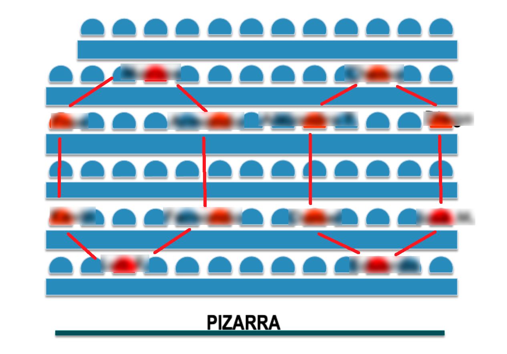

---

 

### El feedback

Se ha hecho empleo de nuevo de la aplicación ***Socrative***, la conocida aplicación para realizar preguntas a los estudiantes y medir el feedback aportado. Los problemas planteados a veces han sido tipo test, pero resueltos en grupos. Estos cuestionarios en ocasiones son evaluables, aunque principalmente miden la progresión académica de la asignatura (y del máster en general).

    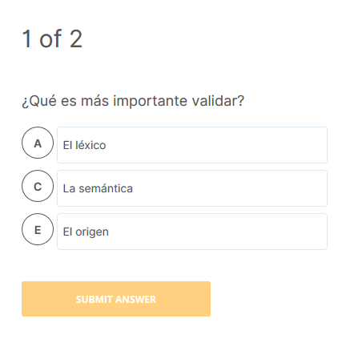

También se ha utilizado en una ocasión un cuestionario externo ***concept inventory/curriculum assessment***, permiten valorar hasta qué punto se han adquirido los conceptos y competencias fundamentales de una disciplina, a través de una serie de preguntas 25 preguntas de tipo test diseñadas.

---

 

### La pedagogía

En esta asignatura se ha insistido en la necesidad de conocer cómo las personas aprendemos (las reglas de oro del aprendizaje) y cómo podemos aprender mejor, que desconocemos aún, como buscamos información y cómo discriminar fuentes primarias de las secundarias.
La revisión crítica de la fuente en la literatura entregada.

Esta sección está basada en psicología cognitiva y se refleja claramente en el artículo referenciado al principio de curso.

[Lessons for learning: How cognitive psychology informs classroom practice](https://kappanonline.org/agarwal-roediger-lessons-for-learning-how-cognitive-psychology-informs-classroom-practice)

 

# Contenidos

## El modelado de amenazas

---

 

- Lectura: **Threat modelling: what, why, and how?** (Threat Modeling: Designing for Security)

- Presentación cruzada: **What’s Your Next Move? Optimizing OT Security Through Automatic Attacker Evaluation**(Yehonatan Kfir, CTO, Radiflow)

  En este *whitepaper* se presenta técnica de Optimización de la seguridad OT mediante la evaluación automática de atacantes. El método está basado en grafos de ataques aplicados a redes industriales.

  

    <a href="pdf/grafos.pdf" target="_blank">
      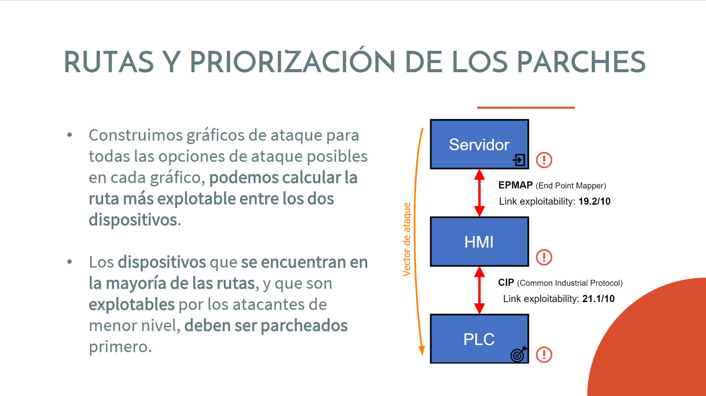
    </a>
  

  Se calculan automáticamente rutas/caminos de posibles intrusiones haciendo uso de vulnerabilidades. Se establecen prioridades según el nivel de amenaza calculada en lo referente al parcheo de dispositivos. Esta metodología puede encontrar la ruta más probable del atacante y priorizar los parches en redes grandes.

  <https://radiflow.com/optimizing-ot-security-through-automatic-attacker-evaluation/>

 

- Resumen de las presentaciones cruzadas de los otros compañeros (La historia de las infraestructuras críticas y Ransomware en infraestructuras críticas)

 

- Lectura: **Capítulo 6 - Access Control** (Security Engineering: A Guide to Building Dependable Distributed Systems, Ross J. Anderson)

  Describe de forma general las diferentes amenazas y mecanismos de seguridad relacionados con diferentes artefactos como sistemas operativos.

 

- Lectura: **Capítulo 4 - Attack Trees** (Threat Modeling: Designing for Security)

  Los árboles de ataque son diagramas conceptuales que muestran cómo un activo u objetivo podría ser atacado. Si el activo atacar corresponden a una arquitectura previamente diseñada podemos crear varios de ellos por cada amenaza identificada.

  

    <a href="https://eopgame.azurewebsites.net/" target="_blank">
      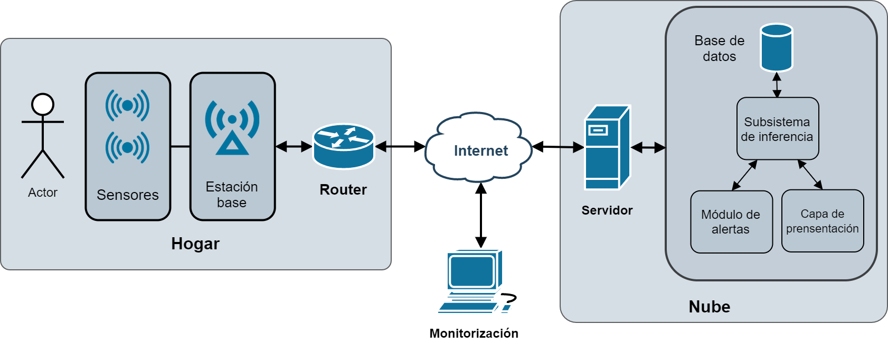
    </a>
  

- **Árboles de ataques**

  Se ven dos posibles amenazadas utilizando los árboles de ataque de modificación indebida de información y repudio en la arquitectura anterior.

  - ***Tampering***

    

      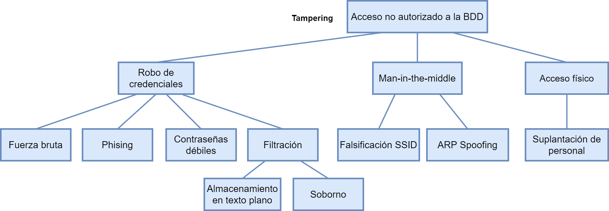
    

  - ***Repudiation***

    

      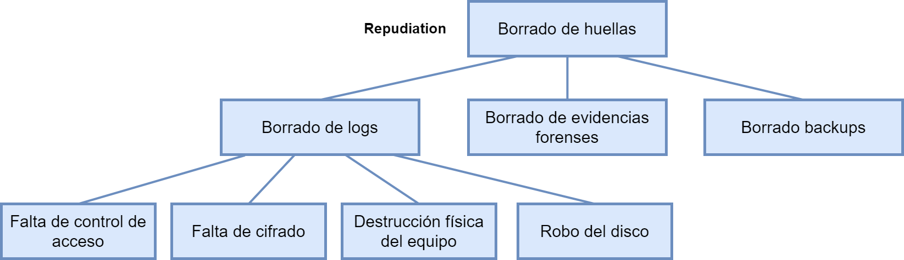
    

 

- **Elevation of Privilege (EoP) Threat Modelling Card Game**

  Se trata de un juego de cartas dirigido a los desarrolladores que los atrae a aprender y ejecutar el modelado de amenazas centrado en software. Expone a los expertos que no son en seguridad al disfrute que los expertos en seguridad aportando al modelado de amenazas conjuntamente.

  

    <a href="https://eopgame.azurewebsites.net/" target="_blank">
      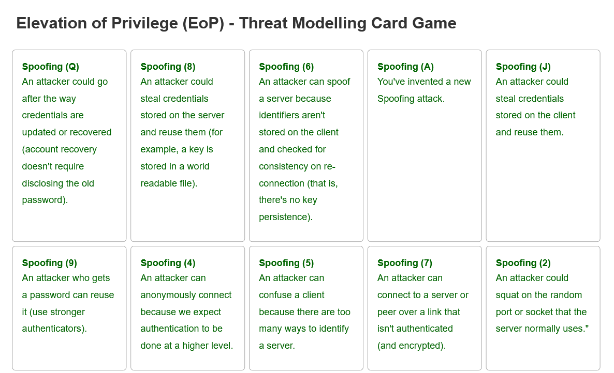
    </a>
  

  <https://eopgame.azurewebsites.net/>

  Este juego se aplica de forma práctica sobre la arquitectura anterior para descubrir nuevas amenazas que no se habían tenido en cuenta.

 

- Lectura y aplicación: **OWASP API Security Top 10**

  Es un ranking de las 10 principales vulnerabilidades y los riesgos de seguridad de las interfaces de programación de aplicaciones (APIs).
  Este modelado de amenazas centrado en las interfaces del sistema ayuda a detectar nuevas vulnerabilidades de la arquitectura del sistema.

  

    <a href="https://owasp.org/www-project-api-security/" target="_blank">
      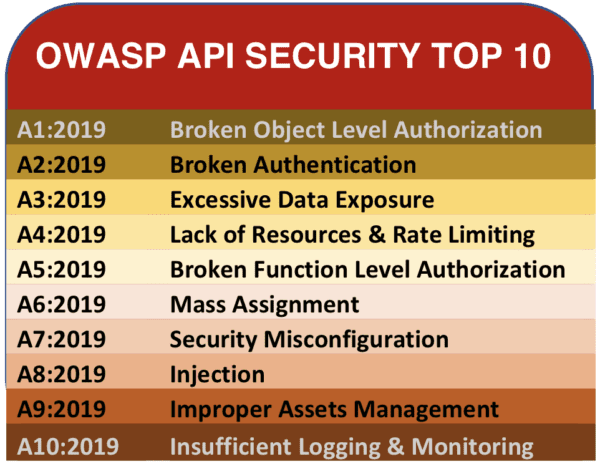
    </a>
  

  <https://owasp.org/www-project-api-security/>

 

- Lectura: **Capítulo 5: Attack Libraries** (Threat Modeling: Designing for Security)

 

## El ciclo de vida de desarrollo seguro

---

 

-  Lectura: **Capítulo 1 - Why design matters for security?/¿Por qué el diseño es importante para la seguridad?** (Secure by Design, Johnson, Deogun y Sawano)

    Secure by Design es uno de los principales libros de la asignatura. Propone utilizar el diseño seguro en el desarrollo software para solventar los problemas de seguridad generados.
    Las principales ideas extraídas son:
  
    - La seguridad es una preocupación, no una característica
    - La trazabilidad como preocupación de seguridad
    - Todas actividades del desarrollo de software son parte del proceso de diseño
    - La seguridad debe ser una prioridad máxima al desarrollar y escribir código
    - El diseño es una parte natural del desarrollo de software

 

- Presentación cruzada: **A Guide for Ensuring Security in Election Technology Procurements** (Center for Internet Security, Inc.)

  Se trata de una guía para garantizar la seguridad en las adquisiciones de tecnología electoral estadounidenses, destinada a funcionarios electorales. El objetivo de este documento es mejorar la seguridad de la infraestructura electoral. Se tratan temas como el ciclo de vida de los productos y el proceso de adquisiciones.

  

    <a href="pdf/electoral.pdf" target="_blank" target="_blank">
      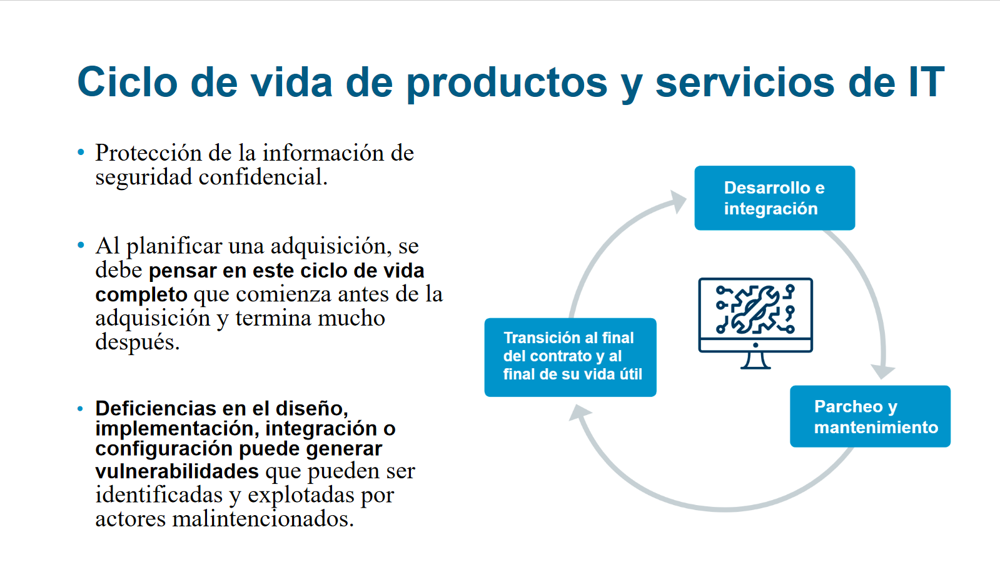
    </a>
  

 

  <https://www.cisecurity.org/press-release/cis-launches-election-technology-procurement-guide/>

 

- Presentación cruzada: **Investigación CVE-2017-11882: SKELETON IN THE CLOSET - MS Office vulnerability you didn’t know about** (Embedi)

  CVE-2017-11882 es una vulnerabilidad publicada en 2017 y aún sigue siendo una de las 10 con mayor uso en 2020. Se aprovecha de componentes OLE embebidos de los documentos Word para realizar ejecución remota de comandos explotando un *bufferoverflow*.

  

    <a href="pdf/skeleton.pdf" target="_blank" target="_blank">
      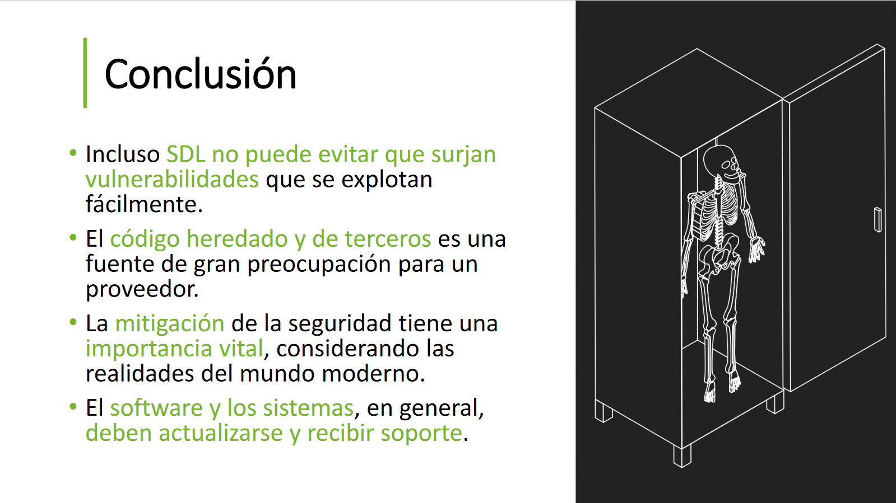
    </a>
  

  El principal problema fue utilizar por compatibilidad hacia atrás de código heredado y de terceros en un editor de ecuaciones (desarrollado en un tiempo en el que nadie seguía las pautas de desarrollo seguro).

 

## Herramientas para el desarrollo de software seguro

---

 

- **BlueHat IL 2020 - David Weston - Keeping Windows Secure**

    

    Se trata de una conferencia de Microsoft en la BlueHat IL 2020, con protagonista David Weston que expone las técnicas empleadas en el desarrollo del sistema operativo. De esta conferencia se extraen 3 ideas fundamentales:
  
    - Priorización de vulnerabilidades, hay que enfocarse en los problemas de mayor impacto y con mayor probabilidad que sucedan (y se conviertan en exploits).
  
    - Automatización del desarrollo en la seguridad, en diferentes niveles, tales como compiladores, *memory safe languages* o *fuzzers* automáticos.

    - Cambio profundo en el modelo de desarrollo de software, de metodologías en cascada a *Agile* (ágiles) debido a los ciclos muy cortos de desarrollo.

 

- **Semmle/CodeQL**
  Se trata de un proveedor de plataforma de análisis de código, que emplea un motor de consultas CodeQL para realizar análisis semántico en bases de código de software, con el fin de encontrar vulnerabilidades en el código. Existe un proyecto de investigación en Github donde se emplea esta tecnología.

  <https://securitylab.github.com/tools/codeql/>

  <https://github.com/github/codeql>

 

- **Watch hackers break into the US power grid**

    

    En este vídeo se muestra como los que equipos de Red Team puede estar muy especializados en seguridad ofensiva en las infraestructuras críticas/sistemas industriales, en este caso concreto en las subestaciones de la red eléctrica estadounidense.

 

## Trabajo de investigación (PEI)

---

La seguridad en el sistema operativo Windows. Trabajo de investigación sobre los **mecanismos de seguridad en el sistema operativo Windows**.

 

  

    <a href="pdf/seguridad_windows.pdf" target="_blank">
      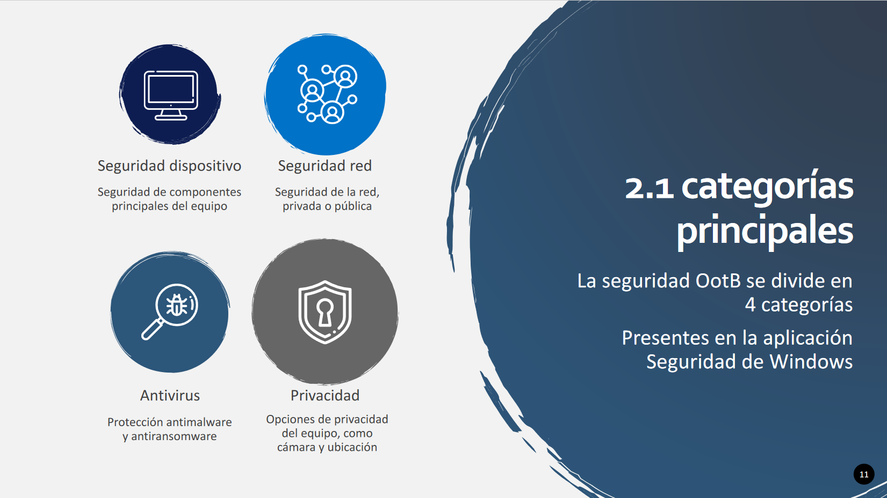
    </a>
  

 

Se encuentra **estructurado** de acuerdo a las diferentes **dimensiones de la seguridad**:
  1. Mecanismos de seguridad
  2. Seguridad out-of-the-box y procedimientos de Hardening
  3. Política de gestión de vulnerabilidades/incidentes
  4. Historial de vulnerabilidades/incidentes

 

  

    <a href="pdf/seguridad_windows.pdf" target="_blank">
      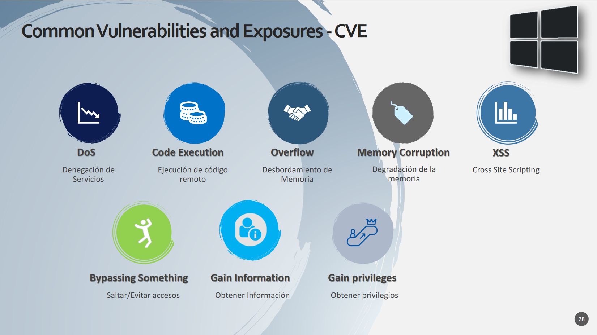
    </a>
  

  
 

- Windows Defender
- Firewall de Windows
- Exploit protection 
- Opciones de privacidad
- Publicación Especial (SP) 800-61 del NIST
- Arranque seguro (secure boot)
- Política de contraseñas
- Coordinated Vulnerability Disclosure
- Bloqueo de Scripts de Powershell
- Listado de actualizaciones
- Listado de vulnerabilidades más representativas

 

  

    <a href="pdf/seguridad_windows.pdf" target="_blank">
      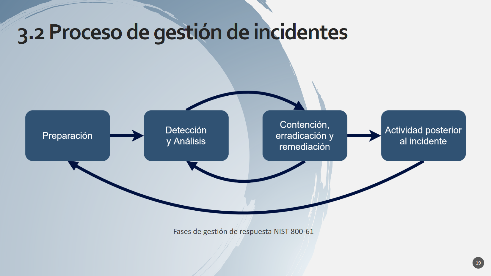
    </a>
  

 

## Diseño y desarrollo de un sistema seguro (PEF)

---

Desarrollo de un sistema inteligente para monitorizar personas mayores y/o dependientes. En él se especifican los objetivos del sistema, los requisitos funcionales y de seguridad.

La arquitectura se basó en una arquitectura IoT de base y a partir de ahí se añadieron sucesivas modificaciones en el diseño para hacerlo seguro ante amenazas identificadas.

 

  

    <a href="pdf/monitorizacion.pdf" target="_blank">
      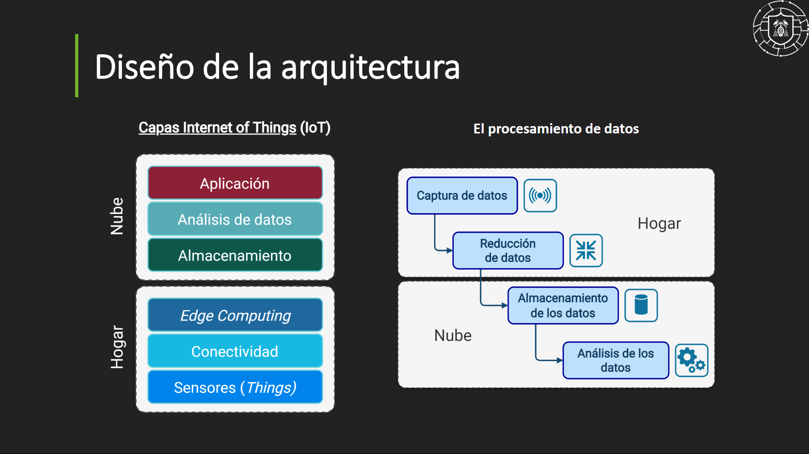
    </a>
  

  

    <a href="pdf/monitorizacion.pdf" target="_blank">
      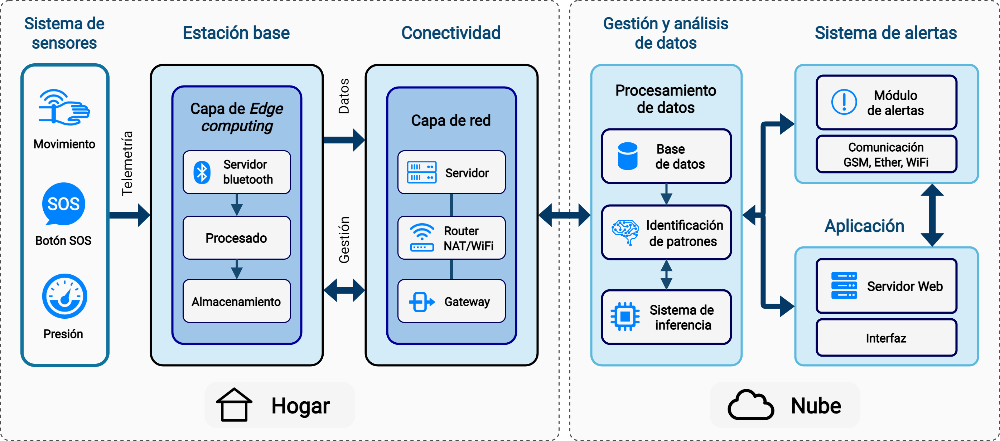
    </a>
  

 

  Se puede observar la evolución de los diagramas físicos del sistema hasta su interacción final.

  

    
  

 

  

    <a href="pdf/monitorizacion.pdf" target="_blank">
      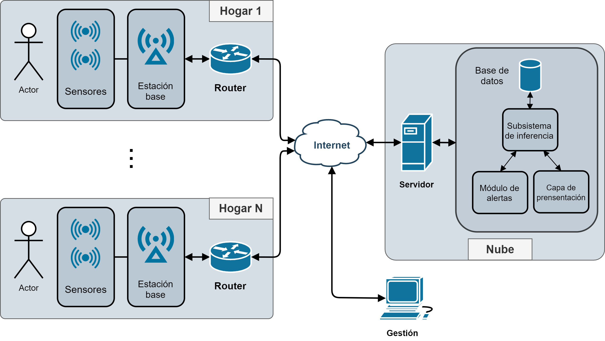
    </a>
  

 

  

    <a href="pdf/monitorizacion.pdf" target="_blank">
      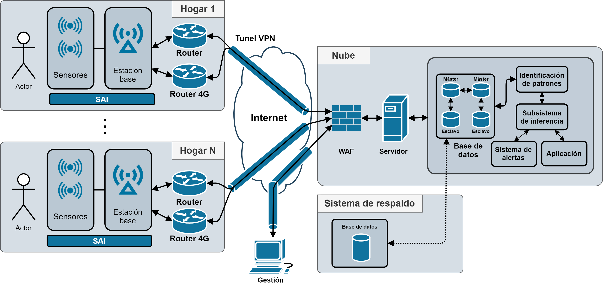
    </a>
  

 

Se selecciona que dispositivos se requieren para su implementación. Se hace un estudio pormenorizado de la cadena de suministro (interacciones entre proveedores y clientes) con el objetivo de asegurarla.

  

    <a href="pdf/monitorizacion.pdf" target="_blank">
      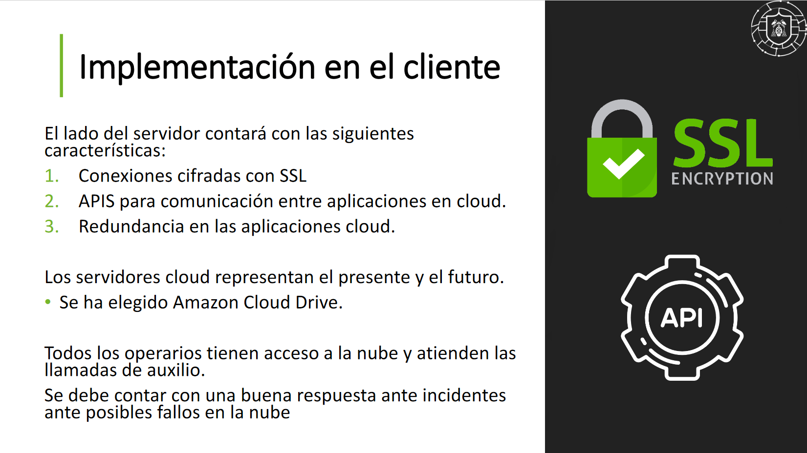
    </a>
  

 

También se ha trabajado con el modelo de amenazas STRIDE, en el que se encuentran amenazas tales como:

  

    <a href="pdf/monitorizacion.pdf" target="_blank">
      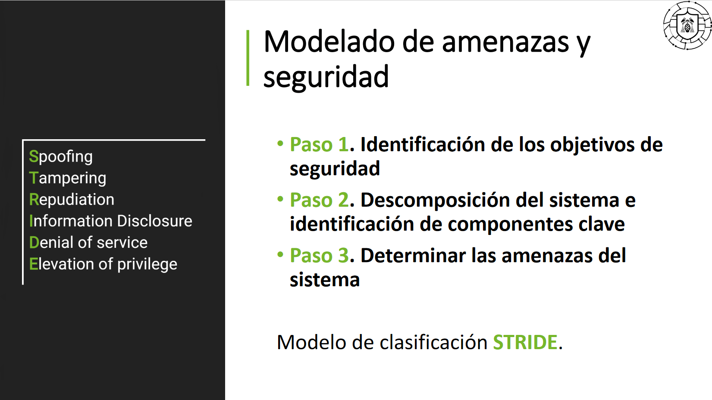
    </a>
  

 

- Suplantación de la persona dependiente
- Falta de autenticación o errores de emparejamiento
- Ataques *Man-in-the-middle*
- *Signal jamming*
- Contraseñas poco seguras
